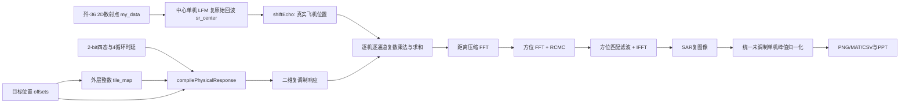

# 项目架构与数据流

## 当前主链路



## 模块说明

### 1. 散射点和飞机模型

- `ship_trans.m`/历史转换脚本从 STL 或 FBX 派生 2D/2.5D 散射点。
- 当前主入口直接加载 Week 4 的 `airplane_scatter_points.mat`，变量 `my_data` 为 3000×2，列顺序 `[方位, 地距]`，跨度约 5.903 m×6.560 m。
- 主入口按等索引抽样至最多 700 点；不是按三角面 RCS 或可见面重新采样。

### 2. SAR 原始回波

每个散射点、每个慢时间脉冲计算瞬时斜距，生成脉内 LFM：

```text
scatter_amplitude * rect(tau/Tp)
* exp(+j*pi*Kr*tau^2)
* exp(-j*4*pi*r/lambda)
```

得到 `sr_center(Na,Nr)`。多机位置用 `shiftEcho` 的二维线性相位近似平移中心模板，而非为每架飞机重新逐点积分。

### 3. 2-bit 时间编码

`fourPhaseRamp` 把归一化周期分成四个槽，输出 `0/90/180/270°` 复反射。距离通道使用快时间相位，方位通道使用慢时间相位。

### 4. 谐波抑制 H primitive

每个 H_k 内部的行、列分别对四个循环时延 `[0,1/10,5/6,14/15]T` 做相干平均，再相乘：

```text
range_average = (1/4) sum_p q2bit(phi_r - 2*pi*d_p)
az_average    = (1/4) sum_q q2bit(phi_a - 2*pi*d_q)
response_k    = az_average * range_average
```

这是 16 个 `P_pq` 子单元的可分离外积等效计算，不是事后频域滤波。

### 5. 外层 H_k 码本

`balancedTileMap(N,K)` 先生成尽量数量均衡的通道 ID，再按蛇形行交织。每个通道的面积权重是其宏格数量除以 `N^2`。目标幅度随面积分配；未做连续权重优化。

### 6. 多飞机

- 共享码本：两架使用相同 offsets；
- 重叠：两个复原始回波的目标位置可重合并在代码相位下相加；
- 独立码本：每架使用不同 offsets/tile_map；
- 四机：四个真实角点分别编译 4 通道核，复原始数据求和。

当前主入口保留复相位，但没有建模独立本振、同步误差或每架真实几何的完整再积分；“严格实验相干”仍是 Partial。

### 7. RD 成像

自定义 `rdFocus` 实现：距离匹配滤波、方位 FFT、线性插值 RCMC、二次相位方位匹配滤波、IFFT。不是 CSA、BP 或 Omega-K。

### 8. 显示和评价

主入口用 `20log10(abs(img))-20log10(reference_peak)`，其中 reference 是未调制中心单机峰值，色标通常 `[-36,0] dB`。现阶段没有自动 PSLR、ISLR、目标区积分能量或全图能量守恒报表。

## 两种不能混用的“自由度仿真”

| 方法 | 脚本 | 叠加域 | 复相位 | 用途 |
|---|---|---|---|---|
| 当前完整法 | `run_full_array_freedom_study.m` | 复原始回波，后做 RD | 保留 | 当前结果与论文证据 |
| 旧快速法 | `run_target_freedom_study.m` | `abs(RD图像)`模板 | 丢失 | 快速构思、面积预算 |

## 外部工具边界

- CAD/STL/FBX：用于生成散射点模型；交接包保留小模型。
- CST：保留历史导出的相位 CSV/TXT；未确认有一套可直接重跑当前 SAR 的完整 CST 工程。
- PowerPoint：0818 为最新版叙事；所有页备注已提取。
- 手机草图：主入口可把黑白图缩放阈值化为 7×7 mask；这是点阵编译原型，不是手机 App 或实时控制系统。
